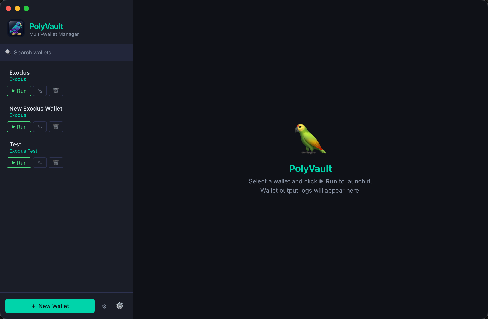
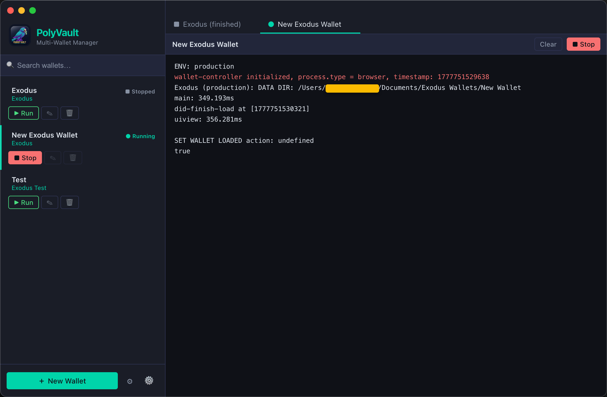

# 🦜 ParrotVault

**Multi-Wallet Manager** — An open-source desktop application for managing and running multiple cryptocurrency wallet instances side by side.



## What is ParrotVault?

ParrotVault lets you organize, launch, and monitor multiple cryptocurrency wallets from a single interface. Instead of juggling separate wallet applications and remembering which data directory belongs to which account, ParrotVault keeps everything in one place.

### Features

- **Run multiple wallets** — Launch any configured wallet with a single click. Each wallet runs as its own process with an isolated data directory.
- **Live output logs** — Watch wallet output in real time. Tabs let you switch between running (and recently finished) wallet sessions.
- **Wallet types** — Define reusable wallet type templates (e.g. Exodus) with a preset executable path and data-directory flag, then create as many wallet instances of that type as you need.
- **Search & organize** — Quickly filter your wallet list with the built-in search bar.
- **Environment variables** — Configure global environment variables that are injected into every spawned wallet process.
- **Local SQLite storage** — All wallet metadata is stored locally in a SQLite database — nothing leaves your machine.



## Tech Stack

| Layer            | Technology                  |
| ---------------- | --------------------------- |
| Desktop shell    | Electron                    |
| UI               | React 18 + TypeScript       |
| State management | Redux Toolkit               |
| Database         | better-sqlite3              |
| Build tooling    | Vite + vite-plugin-electron |

## Installation

### Prerequisites

- **nvm** (Node Version Manager) — recommended for managing Node.js versions

  **macOS / Linux:**

  ```bash
  curl -o- https://raw.githubusercontent.com/nvm-sh/nvm/v0.40.3/install.sh | bash
  ```

  Then restart your terminal (or `source` your shell profile) and verify:

  ```bash
  nvm --version
  ```

  **Windows:** Use [nvm-windows](https://github.com/coreybutler/nvm-windows/releases).

- **Node.js** v22 — install via nvm:

  ```bash
  nvm install   # reads .nvmrc automatically
  nvm use       # switches to the project's Node version
  ```

- **npm** (comes bundled with Node.js)

### Clone & install

```bash
git clone git@github.com:dooglio/parrot-vault.git
cd parrot-vault
npm install
```

### Run in development mode

```bash
npm run electron:dev
```

This starts the Vite dev server and launches Electron with hot-reload.

### Build a distributable

```bash
# macOS (.dmg)
npm run electron:build
```

The packaged app will be written to the `release/` directory.

## License

This project is licensed under the [GNU General Public License v3.0](LICENSE).
